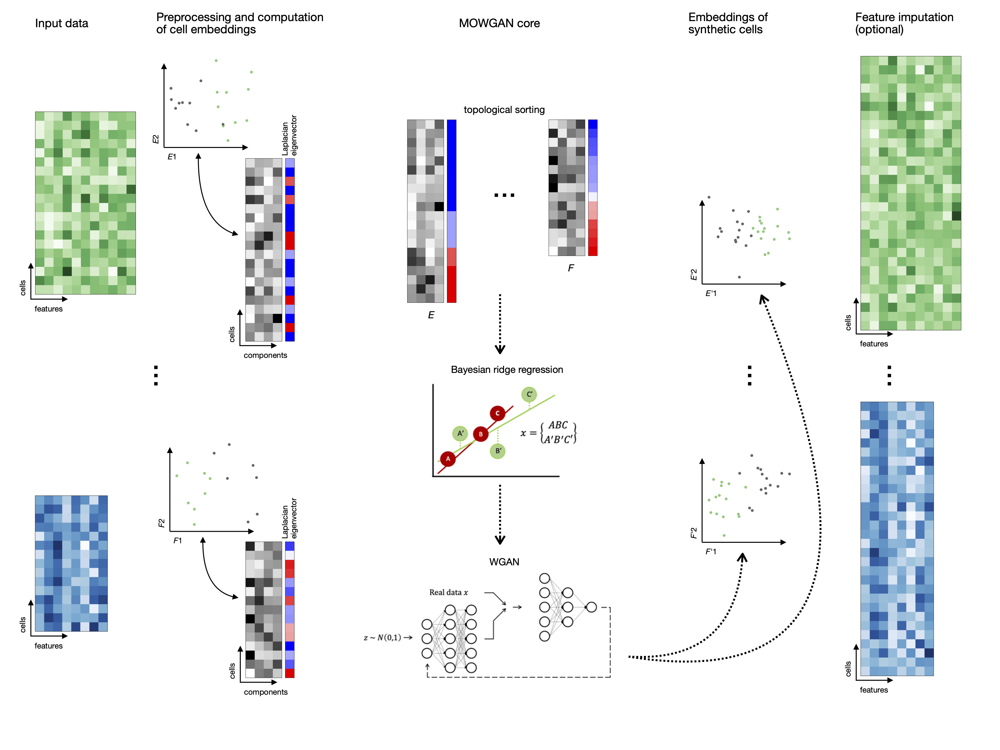

# MOWGAN: Multi-Omics Wasserstein Generative Adversarial Network

<p align="center">

</p>

MOWGAN is a deep learning framework for the generation of synthetic paired multiomics single-cell datasets. The core component is a single Wasserstein Generative Adversarial Network with gradient penalty (WGAN-GP). Inputs are data from multi-omics experiment in unpaired observation. MOWGAN infers the most reliable coupling and train the network to learn the internal structur of the modalities.

Once trained, the generative network is used to produce a new dataset where the observations are matched between all modalities. The synthetic dataset can be used for downstream analysis, first of all to bridge the original unpaired data.

## Installation

MOWGAN was updated to be compatible with Keras 3!! 
MOWGAN is available in PyPI. First, the environment shoud be configured by installing the required packages:

```
conda create -n my_env python=3.11
conda activate my_env
python -m pip install -r requirements.txt
```
Make sure the Tensorflow version is the one compatible with your machine. Then just run:

```
pip install -i https://test.pypi.org/simple/ mowgan
```

## Tutorials

The Tutorials folder contains examples notebooks to use MOWGAN.
* "MOWGAN_toy_training.ipynb" shows, on toy datasets, how to process the data and how to apply MOWGAN in the plain version.
* "MOWGAN_toy_batch_training.ipynb" shows, on toy datasets, how the data should be processed to use MOWGAN with some information to guide the training.
* "MOWGAN_CRC.ipynb" is a MOWGAN application to real data.

## Data

The folder contains anndata objects of public, human-derived colorectal cancer organoids ([E-MTAB-9659](https://www.ebi.ac.uk/biostudies/arrayexpress/studies/E-MTAB-9659)). For the analysis of these datasets, the organoids IDs (i.e., CRC_6, CRC_17 and CRC_19) are used to guide the training. The "MOWGAN_CRC.ipynb" notebook explains how.

## Cheatsheet

MOWGAN main function is the train(). Two version are available, for the plain application and for the guided training. To use them, respectively:

```
from mowgan.train import train

train.train(data, query, n_dim, fill, n_epochs, n_samples, save_name=[], path="")
```

or

```
from mowgan.train import train_batch

train_batch.train(data, query, batch, n_dim, fill, n_epochs, n_samples, save_name=[], path="")
```

where:
* data -> list of anndata objects (e.g., data=[data1, data2])
* query -> list of embeddings (e.g., query=['X_pca','X_umap'])
* batch -> list of annotation to guide the training (e.g., batch=['sample','batch']) (only for batch informed training)
* n_dim -> number of feature to consider in the embeddings (by default, n_dim=15)
* fill -> list of filters for the neural network layers (by default, fill=[512,128])
* n_epochs -> number of training epochs (by default, n_epochs=100000)
* n_samples -> number of samples in the generated data (by default, n_samples=5000)
* save_name -> list of names for MOWGAN data (default is save_name=[], data are saved as "anndata_1.h5ad", "anndata_2.h5ad", etc.)
* path -> path to the working directory (e.g., "my_working_directory/")

## Outputs

MOWGAN saves a set of outputs when running:
* model weights ('MOWGAN_model')
* the critic loss trend ('critic_loss.csv')
* the generator loss trend ('gen_loss.csv')
* anndata objects for each modality 

For the batch informed training, models, loss trend and anndata will be saved for every group defined in the "batch"

## MOWGAN workflow



### Step 1: Data processing
Two, or more datasets, in the anndata format, are processed to filter out observations and variables not usefull for the analysis. Data should be normalized and scaled. It is recommended to select only variable features. In this step, we should calculate the embeddings to use in MOWGAN (e.g., the pca embedding). Moreover, it is required to run scanpy.pp.neighbors().

### Step 2: WGAN-GP training
To train the WGAN-GP, mini-batches are defined. Each dataset is first sorted based on the first component of the Laplacian Eigenmaps (LE). A mini-batch is define on one modality and a Bayesian ridge regressor is trained on the mini-batch embedding and the corresponding eigenvectors. The data from the remaining modalities, concatenated with the already select batch, are the ones returning the higher scores when tested with the Bayesian regressor.

### Step 3: Data reconstruction
The WGAN-GP generetor returns data in the embedding format. A kNN regressor is applied to impute the count matrix. MOWGAN outputs new data object (one for each input modality) with fixed number of cells. The number of variables (and variable names) is equal to the number of variables in the original modality. Moreover, the objects contain the imputed count matrix and the embedding learned by MOWGAN.

## Dependencies
MOWGAN is implemented in Python (>3.11) and uses tensorflow, keras, scanpy as well as the common pandas, numpy, sklearn, and scipy packages. It is recommended to run MOWGAN on GPUs. If only CPUs are available, an error message could appear. In that case, the parameter "amsgrad=True" in the generator optimizer must be removed. 

## Contact
MOWGAN is maintained by Valentina Giansanti (giansanti.valentina@hsr.it) and Davide Cittaro (cittaro.davide@hsr.it). Please, reach us for problems, comments or suggestions.
