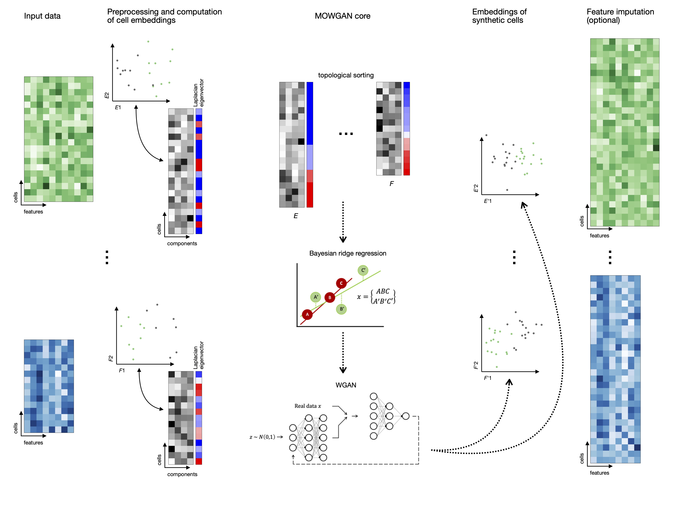

# MOWGAN: Multi-Omics Wasserstein Generative Adversarial Network

<p align="center">

</p>

MOWGAN is a deep learning framework for the generation of synthetic paired multiomics single-cell datasets. The core component is a single Wasserstein Generative Adversarial Network with gradient penalty (WGAN-GP). Inputs are data from multi-omics experiment in unpaired observation. MOWGAN infers the most reliable coupling and train the network to learn the internal structur of the modalities.

Once trained, the generative network is used to produce a new dataset where the observations are matched between all modalities. The synthetic dataset can be used for downstream analysis, first of all to bridge the original unpaired data.

## Installation

MOWGAN has been updated with many new functions!
MOWGAN is available in PyPI. First, the environment shoud be configured by installing the required packages:

```
conda create -n my_env python=3.11
conda activate my_env
python -m pip install -r requirements.txt
```
Make sure the Tensorflow version is the one compatible with your machine. Then just run:

```
pip install -i https://test.pypi.org/simple/ mowgan
```

## Tutorial

The `Tutorial.ipynb` notebook provides a practical example of how to use **MOWGAN**. It is divided into two modes:

- **Global mode** – the entire dataset is used jointly for training.
- **Batch mode** – batch information is taken into account for batch-specific training.

## Data

The folder contains anndata objects of public, human-derived colorectal cancer organoids ([E-MTAB-9659](https://www.ebi.ac.uk/biostudies/arrayexpress/studies/E-MTAB-9659)). For the analysis of these datasets, the organoids IDs (i.e., CRC_6, CRC_17 and CRC_19) are used to guide the training in the **Batch mode**, as explained in the tutorial.

## Cheatsheet

MOWGAN pipeline is composed of a few steps. First of all, we need to import the package:

```
from mowgan.train import MOWGAN
```

Then:

1. Initialize trainer

```
trainer = MOWGAN(
    data,
    query,
    save_name,
    n_dim,
    fill,
    n_epochs,
    path,
    n_samples,
    mode,
    batch
)
```
where:
* data -> list of anndata objects (e.g., data=[data1, data2])
* query -> list of embeddings (e.g., query=['X_pca','X_umap'])
* save_name -> list of names for MOWGAN data (default is save_name=[], data are saved as "anndata_1.h5ad", "anndata_2.h5ad", etc.)
* n_dim -> number of feature to consider in the embeddings (by default, n_dim=15)
* fill -> list of filters for the neural network layers (by default, fill=[512,128])
* n_epochs -> number of training epochs (by default, n_epochs=10000)
* path -> path to the working directory (e.g., "my_working_directory/")
* n_samples -> number of samples in the generated data (by default, n_samples=5000)
* mode -> 'global' by default, or 'batch'
* batch -> list of annotation to guide the training (e.g., batch=['sample','batch']) (only used if mode='batch')

2. Preprocess batches
```
trainer.preprocess_batches()
```
3. Build WGAN
```
trainer.build_model()
```
4. Train and generate synthetic samples
```
trainer.train()
```
5. Merge generated batch data to a single AnnData per modality (only for Batch mode)
```
trainer.merge_batches()
```

If more data are required after the training is complete, we can reload the saved model and ask for new samples

6. Reload and save new data
```
trainer = MOWGAN(data,query,save_name,n_dim,fill,n_epochs,path,n_samples,mode,batch)
trainer.build_model()
trainer.generate_and_construct_anndata(n_samples, batch_idx)
```
where:
* save_name -> shoud be different to the one used in the first trainig to not overwrite the data.
* batch_idx -> is used in Batch mode to specify the batch for which additional data should be generated.

If the last function is applied iteratively across all batches, we can again merge the generated data:
```
trainer.merge_batches()
```

## Outputs

MOWGAN saves a set of outputs when running:
* model weights for the discriminator and the generator ('MOWGAN_model_disc_weights.h5','MOWGAN_model_gen_weights.h5')
* the generator and discriminator loss ('loss_history.pkl')
* anndata objects for each modality
* Scaler model used in the preprocessing, required for the generation of data after the model has been saved ('scalers.pkl')

For the Batch mode, models, loss trend and anndata will be saved for every group defined in the "batch"

## MOWGAN workflow



### Step 1: Data processing
Two, or more datasets, in the anndata format, are processed to filter out observations and variables not usefull for the analysis. Data should be normalized and scaled. It is recommended to select only variable features. In this step, we should calculate the embeddings to use in MOWGAN (e.g., the pca embedding). Moreover, it is required to run scanpy.pp.neighbors().

### Step 2: WGAN-GP training
To train the WGAN-GP, mini-batches are defined. Each dataset is first sorted based on the first component of the Laplacian Eigenmaps (LE). A mini-batch is define on one modality and a Bayesian ridge regressor is trained on the mini-batch embedding and the corresponding eigenvectors. The data from the remaining modalities, concatenated with the already select batch, are the ones returning the higher scores when tested with the Bayesian regressor.

### Step 3: Data reconstruction
The WGAN-GP generetor returns data in the embedding format. A kNN regressor is applied to impute the count matrix. MOWGAN outputs new data object (one for each input modality) with fixed number of cells. The number of variables (and variable names) is equal to the number of variables in the original modality. Moreover, the objects contain the imputed count matrix and the embedding learned by MOWGAN.

## Dependencies
MOWGAN is implemented in Python (>3.11) and uses tensorflow, keras, scanpy as well as the common pandas, numpy, sklearn, and scipy packages. It is recommended to run MOWGAN on GPUs. If only CPUs are available, an error message could appear. In that case, the parameter "amsgrad=True" in the generator optimizer must be removed. 

## Citation
If you use ```MOWGAN``` in your work, please cite ```MOWGAN``` ([paper](https://academic.oup.com/bioinformatics/article/40/5/btae300/7663468)). You can cite all versions of the code by using the ([DOI](https://doi.org/10.5281/zenodo.7875582)).

## Contact
MOWGAN is maintained by Valentina Giansanti (giansanti.valentina@hsr.it) and Davide Cittaro (cittaro.davide@hsr.it). Please, reach us for problems, comments or suggestions.
