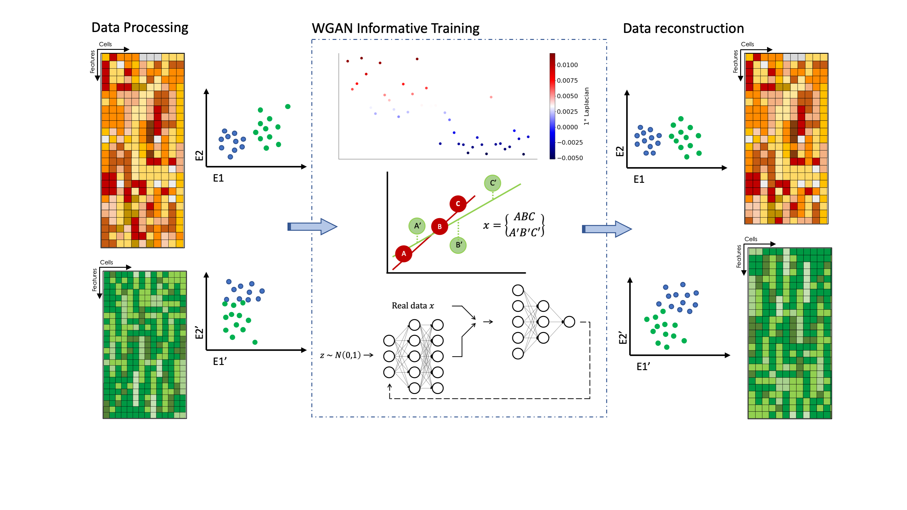

# MOWGAN: Multi-Omics Wasserstein Generative Adversarial Network


MOWGAN is a deep learning framework for the generation of synthetic paired multiomics single-cell datasets. The core component is a single Wasserstein Generative Adversarial Network with gradient penalty (WGAN-GP). Inputs are data from multi-omics experiment in unpaired observation. MOWGAN infers the most reliable coupling and train the network to learn the internal structur of the modalities.

Once trained, the generative network is used to produce a new dataset where the observations are matched between all modalities. The synthetic dataset can be used for downstream analysis, first of all to bridge the original unpaired data.

## Tutorials

The notebook "MOWGAN_training.ipynb" shows, on toy datasets, how to apply MOWGAN to learn and generated coupled datasets.

## Cheatsheet

MOWGAN main function is the train(). How to use it:

```
from MOWGAN.train import train

train.train(data, query, n_dim, fill, n_epochs, n_samples, save_name=[])
```

where:
* data -> list of anndata objects (e.g., data=[data1, data2])
* query -> list of embeddings (e.g., query=['X_pca','X_umap'])
* n_dim -> number of feature to consider in the embeddings (by default, n_dim=15)
* fill -> list of filters for the neural network layers (by default, fill=[512,128])
* n_epochs -> number of training epochs (by default, n_epochs=100000)
* n_samples -> number of samples in the generated data (by default, n_samples=5000)
* save_name -> list of names for MOWGAN data (default is save_name=[], data are saved as "anndata_1.h5ad", "anndata_2.h5ad", etc.)

## MOWGAN workflow



### Step 1: Data processing
Two, or more datasets, in the anndata format, are processed to filter out observations and variables not usefull for the analysis. Data should be normalized and scaled. It is recommended to select only variable features. In this step, we should calculate the embeddings to use in MOWGAN (e.g., the pca embedding). Moreover, it is required to run scanpy.pp.neighbors().

### Step 2: WGAN-GP training
To train the WGAN-GP, mini-batches are defined. Each dataset is first sorted based on the first component of the Laplacian Eigenmaps (LE). A mini-batch is define on one modality and a Bayesian ridge regressor is trained on the mini-batch embedding and the corresponding eigenvectors. The data from the remaining modalities to concatenate with the already select batch, are the ones returning the higher scores when tested with the trained Bayesian regressor.

### Step 3: data reconstruction
The WGAN-GP generetor returns data in the embedding format. A kNN regressor is applied to impute the count matrix. MOWGAN outputs new data object (one for each input modality) with fixed number of cells. The number of variables (and variable names) is equal to the number of variables in the original modality. Moreover, the objects contain the imputed count matrix and the embedding learned by MOWGAN.

## Contact
MOWGAN is maintained by Valentina Giansanti (giansanti.valentina@hsr.it) and Davide Cittaro (cittaro.davide@hsr.it). Please, reach us for problems, comments or suggestions.
